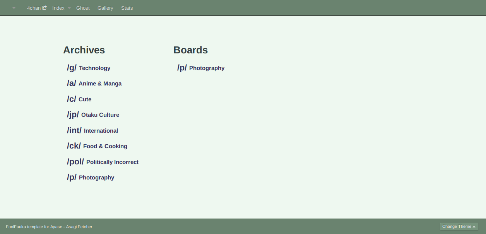
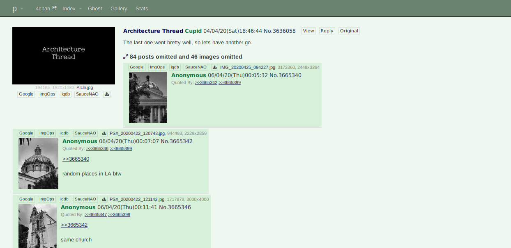
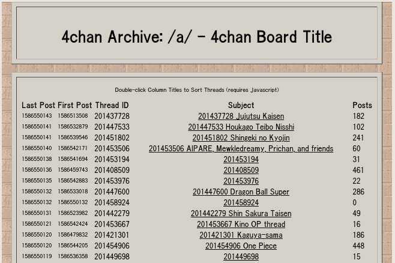
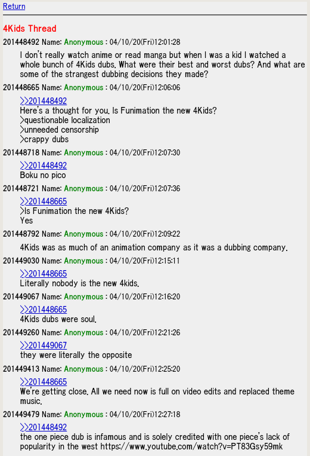

> **Note:** Ayase currently a proof of concept. It now works perfectly with the Asagi schema. Future versions will set up a connection to the both the Asagi and Ayase Schemas.

**Ayase** is a 4chan Archiver API middleware and HTML frontend based on Python, FastAPI, and Jinja2.

It was produced by the Bibliotheca Anonoma as a replacement for FoolFuuka, to be the API Middleware and HTML Templating Frontend to both Asagi and Ayase compatible scrapers, and the definition of the Ayase SQL Standard.

## Installation

Ensure that Python and Pip are installed. Python/PyPy 3.6 or higher is recommended.

```
pip install -U -r requirements.txt
```

## Usage
The following commands will run a server at <http://localhost:8000> . Check the automatically generated API documentation for HTML and REST API endpoint usage information.

Documentation can be seen at
* http://localhost:8000/docs
* http://localhost:8000/redoc

### Foolfuuka (w/ Asagi schema) Template 
To use this template, you will need to have an accessible MySQL DB with an Asagi schema as well as a web server to host static content. We will be using NGINX here.

#### Configuring ayase
This template expects a TOML config file located at `ayase/config.toml`. An example is located in `ayase/config.example.toml`. Here, you can specifiy the database location, enabled archives/boards, and the expected image URL (useful if you plan to grab full images from another archive).

#### Configuring the NGINX Web Server
It is recommended that you setup an nginx front proxy to host static content in production (particularly for images which ayase does not host), however this is not required for testing.

The following is an example Nginx config which will proxy_pass the hug api while also hosting images. 

```
server {
        listen 80;
        location / {
                proxy_pass http://localhost:8000;
        }

        location /img/ {
                alias "/srv/boards/";
                try_files $uri $uri/ = 404;
        }

        location /static/ {
                root "/var/www/ayase/ayase/foolfuuka/";
                try_files $uri $uri/ = 404;

        }
}
```

#### Starting FastAPI
Once everything else is configured, you can start FastAPI with these commands. 

```
cd ayase
uvicorn main:app
```

<!-- ### (Unused) Progrider 4chan Mirror
This is an untouched early proof-of-concept version of ayase separate from the rest of ayase which may be reimplemented as a proper template in the future.

```
cd ayase
uvicorn fourchan:app
``` -->

## HTML Templates

Ayase provides only a few HTML Templates as default, and they are not part of the standard: admins may feel free to use whichever HTML template suits their needs.

Our criteria for default HTML Templates is historical significance that match archived data with the period appropriate theming for the original boards they came from, and most of all an avoidance of anything but HTML5, basic CSS, and ECMAScript unless absolutely necessary.

Only the progrider and foolfuuka template is currently built.

### Foolfuuka Template

Pulled directly from Foolfuuka, this jinja2 template seeks to replicate all Foolfuuka funtionality with a lighter and more efficient code base. 





### Progrider Template

Based on https://github.com/bibanon/world4ch , this jinja2 template is based on clean source code from the progrider textboard when it was still around, which ultimately has its origins in 2ch-style textboard engines.





### Indiachan Template

Out of all these, indiachan (which made a lynxchan template) looks the most modern, and is very nicely optimized for mobile (as mobile devices are the most commonly used computing devices). It even has a pleasing green theme which fits the FoolFuuka theming tradition. I would make this the default theme.

https://gitlab.com/rusty02/indiachan

### LynxChan Templates

Alternatively, the templates on LynxChan actually seem pretty sane, as an 8chan lookalike. These can be used to provide the familiar Yotsuba/Futaba and Burichan themes.

https://gitgud.io/LynxChan/LynxChanFront-Placeholder/-/tree/master/templates/pages

https://gitgud.io/LynxChan/PenumbraLynx/-/tree/master/templates%2Fpages

There are others too we can draw from:

https://gitgud.io/LynxChan/LynxChan-ThirdPartyFrontEnds

### Monaba Template

A template based on Monaba's UI, which is mobile responsive and has good (but also optional) javascript features. Has the benefit of a wealth of stylesheets for users to choose from, including a Futaba and Yotsuba impersonator.

https://github.com/ahushh/Monaba

https://github.com/ahushh/monaba/tree/docker/monaba/static/stylesheets

### Fuuka4plebs Template 

A template based on an previous attempted replacement of FoolFuuka by 4plebs.

### Infinity Template

A template based on 8chan OpenIB/infinity/vichan source code. Since honestly the templates don't look too bad. But maybe it's a bit heavy for our needs.

https://github.com/OpenIB/OpenIB/blob/master/templates/thread.html

### Futaba & Burichan Template

A template recalling the colors of the Futaba/2chan imageboard, which 4chan was based on. 

The [4archive](https://github.com/4archive/4archive) templates could be used for this, a stunning laravel imageboard archive engine that was ultimately never put into use. It looks almost exactly like 4chan, even uses its css (though i'd rather not lol). Maybe even yuki.la is based on this code.

https://github.com/4archive/4archive/blob/master/resources/views/thread/view.blade.php

https://web.archive.org/web/20151014014208/http://4zip.org/qa/thread/290948

https://web.archive.org/web/20151024031527/http://4zip.org/pol/thread/54150010

However that code uses some stolen css from 4chan, I'd rather not bother with that legal and crufty mess at all. So alternatively the Gochan templates can be used as it uses sass, is more up to date, and the template language seems a lot more easily converted to Jinja2.

https://github.com/gochan-org/gochan

Although it lacks the Yotsuba/Futaba CSS, that can be hacked into the burichan one.

https://github.com/gochan-org/gochan/tree/master/sass

### Wakaba Template

This wakaba compatible python jinja2 template engine is the best fit for our needs, as it can be directly utilized. But on the other hand it seems pretty wordy as it doubles as a full imageboard engine as used on desuchan... desuchan.net

* Q. What does "wakarimasen" mean?
* A. I don't know

https://github.com/weedy/wakarimasen

https://github.com/dequis/wakarimasen

It looks like the templates were converted to jinja2 with this crazy python script, which is kind of off putting though... get ready for horrid html code cruft.

https://github.com/dequis/wakarimasen/blob/master/contrib/futaba_to_jinja.py

## Client Support

Any 4chan API client can be modified to work with Ayase's API. There might be some future improved API that some more advanced clients can use, but Ayase will always emit the basic 4chan API for compatibility.

### Clover (Android)

Just modify this to change all the 4chan.org domains to the target archiver domain.

https://chandevel.github.io/Clover/

### Kuroba (Android)

same for this app, and it seems to support loads of other imageboards too.

https://github.com/Adamantcheese/Kuroba

### 4chan-X (WebApp)

Theoretically 4chan-X can be modified to work as a WebUI itself! As was done with the 4plebs-X mockup.
